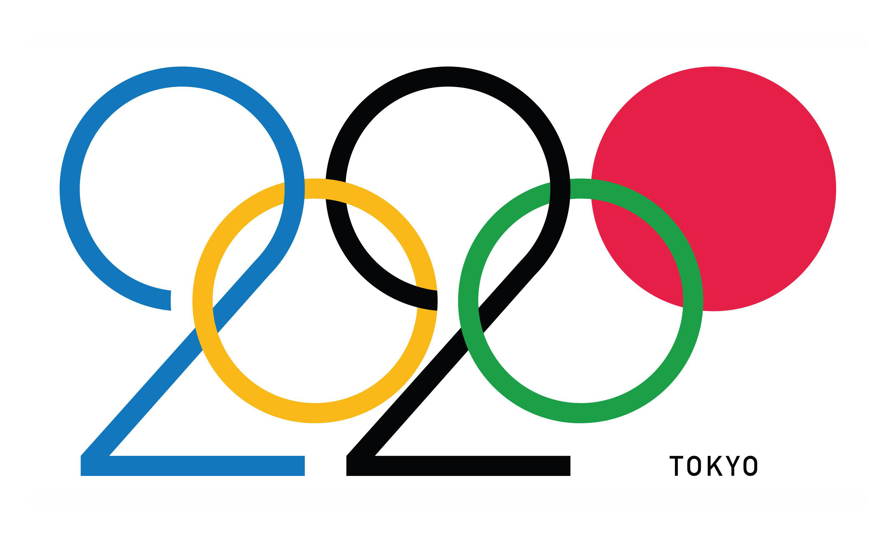

# A Data-Driven Overview at the Tokyo 2020 Olympics

In this short project, I explored the Tokyo 2020 Olympic Games dataset. I performed data analysis and created visualizations to showcase key insights.

In the notebook you will find:

- the data source
- EDA
- visualisations (with matplotlib and seaborn)